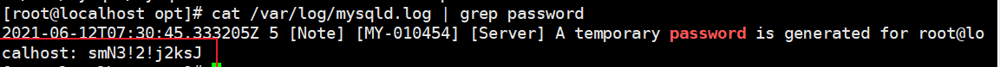
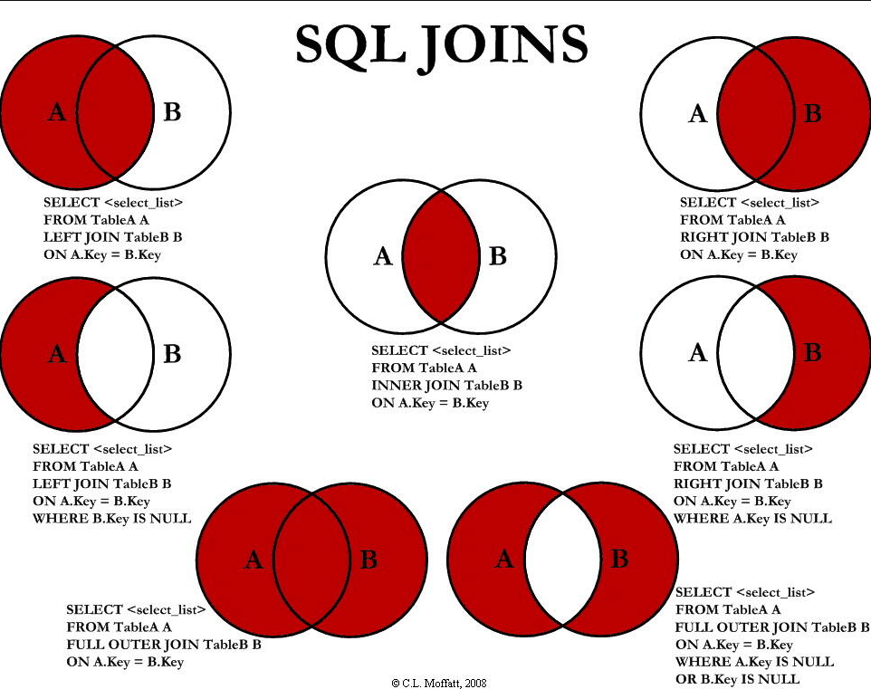

# Mysql 进阶

# 第一章 架构介绍

## 1.2 Linux 下安装 mysql

1. 通过 `wget` 在线下载对应的文件

   ```shell
   wget   https://cdn.mysql.com/archives/mysql-8.0/mysql-8.0.16-2.el7.x86_64.rpm-bundle.tar
   ```

2. [环境监测]：检查是否按照过 mysql

   ```shell
   rpm -qa | grep -i mariadb
   ```

   如果有就去除对应的依赖

   ```shell
   rpm -ev  --nodeps {mysql 依赖名}
   ```

   Centos 中默认安装了 mariadb，需要卸载，避免冲突

   ```shell
   rpm -qa | grep mysql
   rpm -ev --nodeps {mariadb 依赖名}
   ```

3. 解压对应的 mysql 压缩文件

   ```shell
   tar -xvf mysql-8.0.16-2.el7.x86_64.rpm-bundle.tar
   ```

4. 根据指定的安装对应的资源包(common -> libs -> client -> server)

   ```shell
   rpm -ivh mysql-community-common-8.0.16-2.el7.x86_64.rpm
   
   rpm -ivh mysql-community-libs-8.0.16-2.el7.x86_64.rpm
   
   rpm -ivh mysql-community-client-8.0.16-2.el7.x86_64.rpm
   
   rpm -ivh mysql-community-server-8.0.16-2.el7.x86_64.rpm
   ```

5. 启动和查看 mysql 服务

   ```shell
   systemctl start mysqld
   systemctl status mysqld
   ```

6. 查看 root 用户初始随机密码

   ```shell
   cat /var/log/mysqld.log | grep password
   ```

   

7. 使用 root 用户登录 mysql

   ```shell
   [root@localhost ~]# mysql -u root -p
   Enter password: # 为了安全，这里并不会显示密码
   ```

8. 修改 root 用户的密码(第一次使用随机密码登录后，必须修改密码，否则不能进行任何操作)

   ```shell
   mysql> ALTER USER 'root'@'localhost' IDENTIFIED BY 'Root.123456';
   ```

9. 修改 mysql 为开机启动

   ```shell
   chkconfig mysqld on
   ```

10. mysql 字符集编码

    ```shell
    mysql> show variables like '%char%'; #查看字符集编码
    ```

    

    [修改字符集编码](https://blog.csdn.net/weixin_45591980/article/details/108358544?utm_medium=distribute.pc_relevant_t0.none-task-blog-2%7Edefault%7EBlogCommendFromMachineLearnPai2%7Edefault-1.control&depth_1-utm_source=distribute.pc_relevant_t0.none-task-blog-2%7Edefault%7EBlogCommendFromMachineLearnPai2%7Edefault-1.control)

11. [Centos7 中 mysql8 的配置文件配置](https://blog.csdn.net/xm393392625/article/details/103136537)

12. mysql 数据文件目录: `/var/lib/mysql`

## 1.3 配置文件

- 二进制日志 log-bin: 主要用于 **主从复制**
- 错误日志 log-error: (默认关闭)记录严重的警告/错误信息，以及每次启动关闭的信息
- 查询日志 log: (默认关闭)，记录查询的 sql 语句，如果开启会降低 mysql 的整体性能
- 数据文件: `/var/lib/mysql`
  1. 数据库文件 - 对应数据库名的文件名
  2. .frm 文件 - 存放对应的表结构
  3. .myd 文件 - 存放对应的表数据
  4. .myi 文件 - 存放对应的表索引

## 1.4 逻辑架构介绍

和其他数据库相比，MySQL 有点与众不同，它的架构可以在多种不同场景应用并发挥良好作用，主要体现在**存储引擎**上

**插件式的存储引擎架构将查询处理和其他的系统任务以及数据的存储提取相分离**，这种架构可以根据业务的需求和实际需求选择合适的存储引擎


1. 连接层

   客户端和连接服务，包含本地 sock 通信和大多数基于客户端/服务端工具的类似于 tcp/ip 的通信，主要完成一些类似于连接处理、授权认证、及相关的安全方案

   在该层中引入了**线程池**的概念，为通过认证安全的客户端提供线程，同样在该层上可以实现基于 SSL 的安全链接，服务器也会为客户端验证它所具有的操作权限

2. 服务层

   主要完成大多数和核心服务功能，如 SQL 接口，并完成缓存的查询，SQL 的分析和优化及部分内置函数的执行

   所有跨存储引擎的功能也在这一层实现(如过程、函数等)，在这里，服务器会解析查询并创建相应的内部解析树，并对其完成相应的优化(如确定查询表的顺序，是否利用索引等)，最后生成相应的执行操作

   如果是 select 语句，服务器还会查询内部的缓存，如果缓存空间足够大，就能在具有大量读操作的环境中能够很好的提升系统的性能

3. 存储引擎层

   真正负责了 MySQL 中数据的存储和提取，服务器通过 API 与存储引擎通信，不同的存储引擎具有的功能不同，可以根据自己的实际需要进行选取

4. 存储层

   数据存储层，将数据存储在设备的文件系统之上，并完成与存储引擎的交互	

## 1.5 存储引擎

使用 `show engines` 可以查看 mysql 支持的存储引擎


**MyISAM 和  InnoDB 的对比：	**


# 第二章 索引优化分析

## 2.1 SQL 性能下降原因

1. **查询语句没有优化**
2. **索引失效**
3. **关联查询较多 join(设计缺陷/不得已的需求)**
4. 服务器调优及各个参数设置(缓冲，线程数等)
5. 等等

## 2.2 常见通用的 Join 查询

### SQL 执行顺序

程序员: SQL 语句编写顺序

数据库解析: 

1. from 
2. join 
3. on 
4. where 
5. group by(开始使用select中的别名，后面的语句中都可以使用)
6. avg,sum.... 
7. having 
8. select 
9. distinct 
10. order by
11. limit 

### Join 图




### 建表 SQL

```sql
CREATE TABLE `tbl_emp` (
    `id` int(11) NOT NULL AUTO_INCREMENT,
    `name` varchar(20) DEFAULT NULL,
    `deptId` int(11) DEFAULT NULL,
    PRIMARY KEY (`id`) ,
    KEY `fk_dept_id`(`deptId`)
)ENGINE = InnoDB AUTO_INCREMENT = 1 CHARACTER SET = utf8;

CREATE TABLE `tbl_dept` (
    `id` int(11) NOT NULL AUTO_INCREMENT,
    `deptName` varchar(30) DEFAULT NULL,
    `locAdd` varchar(40) DEFAULT NULL,
    PRIMARY KEY (`id`)
) ENGINE = InnoDB AUTO_INCREMENT = 1 CHARACTER SET = utf8;
```

```sql
INSERT INTO tbl_dept(deptName,locAdd) VALUES('RD', 11);
INSERT INTO tbl_dept(deptName,locAdd) VALUES('HR', 12);
INSERT INTO tbl_dept(deptName,locAdd) VALUES('MK', 13);
INSERT INTO tbl_dept(deptName,locAdd) VALUES('MIS', 14);
INSERT INTO tbl_dept(deptName,locAdd) VALUES('FD', 15);

INSERT INTO tbl_emp(NAME, deptId) VALUES('z3', 1);
INSERT INTO tbl_emp(NAME, deptId) VALUES('z4', 1);
INSERT INTO tbl_emp(NAME, deptId) VALUES('z5', 1);

INSERT INTO tbl_emp(NAME, deptId) VALUES('w5', 2);
INSERT INTO tbl_emp(NAME, deptId) VALUES('w6', 2);

INSERT INTO tbl_emp(NAME, deptId) VALUES('s7', 3);
INSERT INTO tbl_emp(NAME, deptId) VALUES('s8', 4);
INSERT INTO tbl_emp(NAME, deptId) VALUES('s9', 51);
```

### 七种 JOIN 演示

1. 内连接

   

2. 左外连接

   

3. 右外连接

   

4. 左不包括连接: 和右表做左外连接后，排除交集

   

5. 右不包括连接：和左表做右外连接后，排除交集

   

6. 全外连接: 由于 mysql 中并不支持 **FULL** **OUTER** 所以需要通过 `union` 使用(合并&去重) - 左外连接 + 右外连接

   

7. 全不包括连接: 在全外连接的基础上排除共有的 (左不包括连接 + 右不包括连接)

   

## 2.3 索引简介  

### 是什么

> 一种数据结构，可以帮助 mysql 高效的获取数据

- 简单理解：**排好序的快速查找数据结构**(针对 WHERE 和 ORDER BY)

- 数据库除了保存数据之外，**还会维护满足特定查询算法的数据结构**，这些数据结构以某种方式引用(指向)数据

- 数据库基于这些数据结构就可以实现高价查找算法，而这种数据结构就是索引

- 例如索引可能是一个二叉排序树

  

  每个节点保存**对应的索引键值和一个指向对应数据记录物理地址的指针**，这样就是通过二分查询算法在一定的复杂度内获取得到对应的数据，从而快速的检索出符合条件的记录

- 一般来说索引的本身也很大，不可能全部存储在内存中，因此索引往往是以索引文件的形式存储在磁盘上的

- 平常所说的索引，如果没有特别指明，都是指 B 树(多路搜索树，并不一定是二叉树)。

  其中聚集索引，次要索引，覆盖索引，复合索引，前缀索引，唯一索引默认都是 B+ 树，统称索引

  还有 Hash 索引等

### 优势

1. 提高数据检索的效率，降低数据库的 I/O 成本
2. 通过索引列对数据进行排序，降低数据排序的成本，降低 CPU 的消耗

### 劣势

1. 实际上索引也是一张表，该表保存的对应主键和索引字段，并指向实体表的记录，所以索引列也需要占用空间

2. 虽然索引提高了查询的效率，但对于的 INSERT，UPDATE，DELETE 操作来说，除了操作数据之外，还需要操作对应的索引

   所以就会导致其效率降低

3. 索引只是提高效率的一个速度，如果 Mysql 中存在数据量大的表，是需要花时间才可以建立出优秀的索引的

### mysql 索引分类

**基本分类：**

1. 单值索引 - 一个索引只包含单个列，一个表中允许存在多个单值索引
2. 唯一索引 - 索引列的值必须唯一，但允许为空
3. 复合索引 - 一个索引中包含多个列

**基本语法：**

- 创建 - 

  ```sql
  CREATE [UNIQUE] INDEX index_name ON table_name(columnList) #如果是一列就是单列索引，如果是多列就是复合索引
  ALTER table_name ADD [UNIQUE] INDEX index_name ON (columnList)
  ```

- 删除

  ```sql
  DROP INDEX index_name ON table_name
  ```

- 查看

  ```sql
  SHOW INDEX FROM table_name;
  ```

- 通过 ALTER 命令添加索引 

  

### mysql 索引结构

**基本分类：**

- **BTree**
- **Hash**
- **full-text全文索引**
- **R-Tree索引**

**BTree 原理分析：**

- 图示

  

- 初始化介绍

  一颗 B+ 树， 蓝色部分称之为一个磁盘块，其中包含了数据项(白色区域)和指针(黄色区域)

  **真实数据只存储在叶子节点**，非叶子节点只存储指引搜索方向的数据项

### 应用场景

**适合创建索引的场景：**

1. 主键自动建立唯一索引
2. 频繁的作为查询条件的字段应该创建索引
3. 查询表中与其他表关联的字段，外键关系应该创建索引
4. 频繁更新的字段不适合创建索引 (因为每次更新不单单是更新了记录还有更新索引)
5. Where 语句中使用不到的字段创建索引
6. 单列和复合索引？高并发的情况下推荐复合索引
7. 查询中排序的字段，可以创建索引
8. 查询中统计/分组字段

**不适合创建索引的场景：**

1. 表的记录比较少的(

2. 创建增删改的表

3. 如果某个数据列包含多个重复的内容，为它创建的索引的意义就不大

   

## 2.4 性能分析 

### Mysql Query Optimizer

- MySQL 中有专门负责**优化 Select 语句的优化器模块**，主要功能：通过计算分析系统中收集到的统计信息，为客户端请求的Query 提供他认为最优的执行计划（他认为最优的数据检索方式，但不见得是 DBA 认为最优的，这部分最耗费时间）
- 当客户端向 MySQL 请求一条 Query，命令解析器模块完成请求分类，区别出是 Select 并转发给 MySQL Query Optimizer时，MySQL Query Optimizer 首先会对整条Query进行优化，处理掉一些常量表达式的预算，直接换算成常量值。并对Query中的查询条件进行简化和转换，如去掉一些无用或显而易见的条件、结构调整等。然后分析Query中的Hint信息（如果有），看显示Hint信息是否可以完全确定该Query的执行计划。如果没有Hint或Hint信息还不足以完全确定执行计划，则会读取所涉及对象的统计信息，根据Query进行写相应的计算Fenix，然后再得出最后的执行计划。

### Mysql 常见瓶颈

1. CPU：CPU 在饱和时一般发生在数据装入内存中或从磁盘上读取数据时
2. I/O: 发生在装入数据远大于内存容量时
3. 服务器硬件：可以通过 `top,free,iostat,vmstat` 来查看系统的性能状态 

### Explain

> 使用 Explain 关键字可以模糊优化器执行 SQL 查询语句，从而可以得知 Mysql 是如何处理你的 SQL 语句

使用方式：EXPLAIN + SQL 查询语句


**作用**：

1. 表的读取顺序
2. 数据读取操作的数据类型
3. 哪些索引可以使用
4. 哪些索引被实际使用
5. 表之间的引用
6. 每张表有多少行被优化器查询

**关键字段解释**:

1. **id** - select 查询的序列号 ，包含一组数字，表示查询中执行 select 子句

   三种情况：

   1. id 相同，执行顺序从上到下

   2. id 不同，执行顺序从大到下(例如嵌套子查询时，id 就会递增 )

   3. id 相同不同，同时存在

      

      id 如果相同，可以认为是一组的，从上往下顺序执行，在所有组中，id 值越大，优先级越高，越先执行

2. **select_type** - 查询的类型(普通/联合/子查询)

   基本类型：

   

   类型说明：

   1. SIMPLE：简单的 select 查询，查询中不包含子查询和 union

   2. PRIMARY：查询中若包含任何复杂的子查询，最外层便为 PRIMARY

   3. SUBQUERY：在 SELECT / WHERE 列表中包含的子查询

   4. DERIVED：在 FROM 列表中包含的子查询会被标记为 DERIVED(衍生), Mysql 会递归执行这些子查询，将结果放在临时表中

   5. UNION：若第二个 SELECT 出现在 UNION 之后，则被标记为 UNION 

      若 UNION 包含在 FROM 子句的子查询中，外层的 SELCT 被标记为 DERIVED

   6. UNION RESULT

      从 UNION 表获取结果的 SELECT

3. **table** - 显示这一行是关于哪张表的

4. **type** - Mysql 使用了何种方式访问该表

   从最好到最差依次是：system > const > eq_ref > ref > range > index > all

   | 类型名称 | 具体作用                                                     |
   | -------- | ------------------------------------------------------------ |
   | system   | 表中只有一行记录(等于 const 表)，是 conts 类型的特列，平时不会出现，可以忽略不计 |
   | const    | 表示通过一次索引就查找到了数据，const 通常出现在使用**常量值**与 **primary key 或 unique 索引列**进行比较，因为只匹配一行数据，所以很快。 |
   | eq_ref   | 唯一性索引扫描，primary key / unique 索引列在联合查询中使用，且最多只会返回一条记录<br />例如在连接查询时，如果有一张表是通过 **主键/UNIQUE索引列** (如果是组合索引，所有索引列必须参与）进行等值匹配的方式来访问数据的 |
   | ref      | 非唯一性索引扫描，当使用某个常量值与 **主键/唯一性索引的部分列/普通索引** 进行匹配，且可能返回多条记录时 |
   | range    | 范围扫描，一般只出现在 `in(),bwteen,>,<,>=` 等操作中，使用一个索引来检索给定范围的行 |
   | index    | 和 ALL 的区别在于只遍历索引树，通常比 ALL 快，因为索引文件比数据文件小 |
   | all      | 全表扫描                                                     |

   最好可以到 ref，保证到达 range

5. **possible_keys** - 本次查询中可能会用到的索引

6. **key** - 本次擦护心中实际用到的索引(如果出现了**覆盖索引**，则该索引仅会出现在 key 中)

7. **key_len** - 表示 mysql 中在**索引**中使用的字节数，可以通过使用的索引列情况计算出该值，在不损失精确度的情况下，该值越小越好

   key_len 的计算使用的是索引的最大可能长度，**并非实际使用长度**，而 key_len 是根据表结构定义计算得出的

   > key_len 计算规则如下：
   >
   > 字符串
   >
   > - char(n)：n字节长度
   >
   > - varchar(n)：2字节存储字符串长度，如果是utf-8，则长度 3n + 2 
   >
   > 数值类型
   >
   > - tinyint：1字节
   > - smallint：2字节
   > - int：4字节
   > - bigint：8字节
   >
   > 时间类型
   >
   > - date：3字节
   > - timestamp：4字节
   > - datetime：8字节
   >
   > **如果该索引列允许存储 NULL 值，则额外需要 1 字节的空间**

8. **ref** - mysql 在进行表查询时，表中索引使用的列/常量(const（常量），字段名（例：`数据库.数据表.字段`）)

9. **rows** - mysql 找到所需记录大致需要读取的行数(但不是结果集的行数)

10. **Extra** - 说明一些额外信息的，我们可以通过这些额外信息来更准确的理解MySQL到底将如何执行给定的查询语句。

    - **Using  filesort**：mysql 会对数据使用一个外部的索引排序，而不是按照表内的索引顺序进行读取

      Mysql 中无法利用索引完成的排序操作称为 **文件排序** - 无论是否使用索引列，都应该避免 Using filesort

    - **Using temporary**：在 mysql 执行查询过程中，可能会借助临时表来完成一些功能(去重，排序之类的)，比如我们在执行许多包含 `DISTINCT、GROUP BY、UNION` 等子句的查询过程中，如果不能有效利用索引来完成查询，MySQL很有可能寻求通过建立内部的临时表来执行查询。如果查询中使用到了内部的临时表，在执行计划的 Extra 列将会显示Using temporary提示

    - **Using Index**: 在进行 select 时使用了 ==覆盖索引==，避免访问了表的数据行，是性能高的表现

      如果同时出现 using where，表示索引被用来执行索引键值查找

      如果没有同时出现 using where，表示索引用来读取数据而非执行查找动作

      **覆盖索引：** select 查询的数据列可以通过索引得到，不必读取数据行，Mysql 可以利用其返回 select 列表中的字段，而不必根据索引再次读取数据文件，也就是 ==查询列所建的索引覆盖==

    - **Using Where**: 使用 Where 子句过滤

    - **Using Join buffer**: 使用了连接缓存

    - **impossible where:**  where 子句总是 false，不能用来获取任何元组

## 2.5 索引优化 

### 案例

#### 1) 单表

**建表sql：**

```sql
CREATE TABLE IF NOT EXISTS `article`(
`id` INT(10) UNSIGNED NOT NULL PRIMARY KEY AUTO_INCREMENT,
`author_id` INT (10) UNSIGNED NOT NULL,
`category_id` INT(10) UNSIGNED NOT NULL , 
`views` INT(10) UNSIGNED NOT NULL , 
`comments` INT(10) UNSIGNED NOT NULL,
`title` VARBINARY(255) NOT NULL,
`content` TEXT NOT NULL
);
INSERT INTO `article`(`author_id`,`category_id` ,`views` ,`comments` ,`title` ,`content`)VALUES
(1,1,1,1,'1','1'),
(2,2,2,2,'2','2'),
(3,3,3,3,'3','3');

SELECT * FROM article;
```

**优化 SQL 语句：**

```sql
SELECT id,author_id FROM article WHERE category_id = 1 AND comments > 1 ORDER BY `views` DESC LIMIT 1;
```

**不创建任何索引使用的情况：**


**对于查询和分组使用的列，可以创建一个复合索引：**

```sql
CREATE INDEX idx_article_ccv ON article(category_id, comments, `views`);
```

查看使用索引后的情况：


可以发现，==Using filesort== 的问题仍未解决 -> 按照工作原理，会依次按照索引列的顺序进行排序(category_id -> comments -> views)，但由于此查询语句中使用了 `comments > 1` 的条件是一个范围值(所谓 range)，Mysql 无法利用索引再对后面的 view 部分进行检索，**即 range 类型查询索引字段后的索引无效**

**删除原索引，重新构建索引：**

```sql
DROP INDEX idx_article_ccv ON article;
CREATE INDEX idx_article_ccv ON article(category_id,  views); # 去掉 comments
```

重新 EXPLAIN: 优化成功


#### 2) 双表

**建表 sql:**

```sql
CREATE TABLE IF NOT EXISTS `class`(
`id` INT(10) UNSIGNED NOT NULL PRIMARY KEY AUTO_INCREMENT,
`card` INT (10) UNSIGNED NOT NULL
);
CREATE TABLE IF NOT EXISTS `book`(
`bookid` INT(10) UNSIGNED NOT NULL PRIMARY KEY AUTO_INCREMENT,
`card` INT (10) UNSIGNED NOT NULL
);
INSERT INTO class(card)VALUES(FLOOR(1+(RAND()*20)));
INSERT INTO class(card)VALUES(FLOOR(1+(RAND()*20)));
INSERT INTO class(card)VALUES(FLOOR(1+(RAND()*20)));
INSERT INTO class(card)VALUES(FLOOR(1+(RAND()*20)));
INSERT INTO class(card)VALUES(FLOOR(1+(RAND()*20)));
INSERT INTO class(card)VALUES(FLOOR(1+(RAND()*20)));
INSERT INTO class(card)VALUES(FLOOR(1+(RAND()*20)));
INSERT INTO class(card)VALUES(FLOOR(1+(RAND()*20)));
INSERT INTO class(card)VALUES(FLOOR(1+(RAND()*20)));
INSERT INTO class(card)VALUES(FLOOR(1+(RAND()*20)));
INSERT INTO class(card)VALUES(FLOOR(1+(RAND()*20)));
INSERT INTO class(card)VALUES(FLOOR(1+(RAND()*20)));
INSERT INTO class(card)VALUES(FLOOR(1+(RAND()*20)));
INSERT INTO class(card)VALUES(FLOOR(1+(RAND()*20)));
INSERT INTO class(card)VALUES(FLOOR(1+(RAND()*20)));
INSERT INTO class(card)VALUES(FLOOR(1+(RAND()*20)));
INSERT INTO class(card)VALUES(FLOOR(1+(RAND()*20)));
INSERT INTO class(card)VALUES(FLOOR(1+(RAND()*20)));
INSERT INTO class(card)VALUES(FLOOR(1+(RAND()*20)));
INSERT INTO class(card)VALUES(FLOOR(1+(RAND()*20)));
 
INSERT INTO book(card)VALUES(FLOOR(1+(RAND()*20)));
INSERT INTO book(card)VALUES(FLOOR(1+(RAND()*20)));
INSERT INTO book(card)VALUES(FLOOR(1+(RAND()*20)));
INSERT INTO book(card)VALUES(FLOOR(1+(RAND()*20)));
INSERT INTO book(card)VALUES(FLOOR(1+(RAND()*20)));
INSERT INTO book(card)VALUES(FLOOR(1+(RAND()*20)));
INSERT INTO book(card)VALUES(FLOOR(1+(RAND()*20)));
INSERT INTO book(card)VALUES(FLOOR(1+(RAND()*20)));
INSERT INTO book(card)VALUES(FLOOR(1+(RAND()*20)));
INSERT INTO book(card)VALUES(FLOOR(1+(RAND()*20)));
INSERT INTO book(card)VALUES(FLOOR(1+(RAND()*20)));
INSERT INTO book(card)VALUES(FLOOR(1+(RAND()*20)));
INSERT INTO book(card)VALUES(FLOOR(1+(RAND()*20)));
INSERT INTO book(card)VALUES(FLOOR(1+(RAND()*20)));
INSERT INTO book(card)VALUES(FLOOR(1+(RAND()*20)));
INSERT INTO book(card)VALUES(FLOOR(1+(RAND()*20)));
INSERT INTO book(card)VALUES(FLOOR(1+(RAND()*20)));
INSERT INTO book(card)VALUES(FLOOR(1+(RAND()*20)));
INSERT INTO book(card)VALUES(FLOOR(1+(RAND()*20)));
INSERT INTO book(card)VALUES(FLOOR(1+(RAND()*20)));
```

**优化左外连接**：

```sql
SELECT * FROM class LEFT JOIN book ON class.card = book.card;
```

**不创建任何索引使用的情况：**


**索引建立在左表还是右表 ?** -> 由于是左外连接及时将所有建立在左表，依然会遍历所有行数(右外连接同理)，所以索引应该建立在右表

**在右表上创建索引：**

```sql
CREATE INDEX idx_book_card ON book(card);
```

重新 EXPLAIN 下: 


> 可以实验下将所有建立在左表的效果，右外连接同理

#### 3) 三表

**建表 sql:**

> 在双表的基础下实验

```sql
CREATE TABLE IF NOT EXISTS `phone`(
`phoneid` INT(10) UNSIGNED NOT NULL PRIMARY KEY AUTO_INCREMENT,
`card` INT (10) UNSIGNED NOT NULL
)ENGINE = INNODB;

INSERT INTO phone(card)VALUES(FLOOR(1+(RAND()*20)));
INSERT INTO phone(card)VALUES(FLOOR(1+(RAND()*20)));
INSERT INTO phone(card)VALUES(FLOOR(1+(RAND()*20)));
INSERT INTO phone(card)VALUES(FLOOR(1+(RAND()*20)));
INSERT INTO phone(card)VALUES(FLOOR(1+(RAND()*20)));
INSERT INTO phone(card)VALUES(FLOOR(1+(RAND()*20)));
INSERT INTO phone(card)VALUES(FLOOR(1+(RAND()*20)));
INSERT INTO phone(card)VALUES(FLOOR(1+(RAND()*20)));
INSERT INTO phone(card)VALUES(FLOOR(1+(RAND()*20)));
INSERT INTO phone(card)VALUES(FLOOR(1+(RAND()*20)));
INSERT INTO phone(card)VALUES(FLOOR(1+(RAND()*20)));
INSERT INTO phone(card)VALUES(FLOOR(1+(RAND()*20)));
INSERT INTO phone(card)VALUES(FLOOR(1+(RAND()*20)));
INSERT INTO phone(card)VALUES(FLOOR(1+(RAND()*20)));
INSERT INTO phone(card)VALUES(FLOOR(1+(RAND()*20)));
INSERT INTO phone(card)VALUES(FLOOR(1+(RAND()*20)));
INSERT INTO phone(card)VALUES(FLOOR(1+(RAND()*20)));
INSERT INTO phone(card)VALUES(FLOOR(1+(RAND()*20)));
INSERT INTO phone(card)VALUES(FLOOR(1+(RAND()*20)));
INSERT INTO phone(card)VALUES(FLOOR(1+(RAND()*20)));
```

**删除双表的原索引：**

```sql
DROP INDEX idx_book_card ON book;
```

**优化 SQL：**

```sql
SELECT * FROM class LEFT JOIN book ON class.card = book.card LEFT JOIN phone ON book.card = phone.card;
```

**不创建任何索引使用的情况：**


和双表的原理不变，左外连接时应该对右表建立索引

**在两个右表 book & phone 上建立索引：**

```sql
CREATE INDEX idx_book_card ON book(card);
CREATE INDEX idx_phone_card ON phone(card);
```

**重新 EXPLAIN 下:**


#### 4) JOIN 优化总结：

1. 尽可能减少 Join 语句中的 [NestedLoop](https://blog.csdn.net/u010841296/article/details/89790399) 的循环总次数 -> **永远用小结果集驱动大结果集**
2. 优化 NestedLoop 的内层循环
3. 保证 Join 语句中被驱动表上 Join 条件字段已经加上索引
4. 当无法保证被驱动表的 Join 条件字段被索引且资源充足的情况下，不要太吝啬 JoinBuffer 的设置

### 避免索引失效

> 

#### 1) 建表 sql

```sql
CREATE TABLE staffs(
    id INT PRIMARY KEY AUTO_INCREMENT,
    `name` VARCHAR(24)NOT NULL DEFAULT'' COMMENT'姓名',
    `age` INT NOT NULL DEFAULT 0 COMMENT'年龄',
    `pos` VARCHAR(20) NOT NULL DEFAULT'' COMMENT'职位',
    `add_time` TIMESTAMP NOT NULL DEFAULT CURRENT_TIMESTAMP COMMENT'入职时间'
) CHARSET utf8 COMMENT'员工记录表';
INSERT INTO staffs(`name`,`age`,`pos`,`add_time`) VALUES('z3',22,'manager',NOW());
INSERT INTO staffs(`name`,`age`,`pos`,`add_time`) VALUES('July',23,'dev',NOW());
INSERT INTO staffs(`name`,`age`,`pos`,`add_time`) VALUES('2000',23,'dev',NOW());

ALTER TABLE staffs ADD INDEX index_staffs_nameAgePos(`name`,`age`,`pos`)
```

#### 2) 口诀

**全值匹配我最爱:**

```sql
EXPLAIN SELECT *  FROM staffs where name = 'byq' AND age = '18' AND pos = 'archer';
```


```sql
EXPLAIN SELECT *  FROM staffs where name = 'byq' AND pos = 'archer' AND age = 20; 
#如果索引列全部使用了，那么顺序可以无所谓，mysql 底层会进行优化
```


**最左前缀要遵守:** - 带头大哥不能死，中间兄弟不能断；

```sql
EXPLAIN SELECT *  FROM staffs where name = 'byq' AND pos = 'archer';
# 如果是复合索引，那么就要遵守最左前缀法则(即查询从索引的最左前列开始并且不跳过索引中的列)
```


**索引列上少计算：**

```sql
EXPLAIN SELECT *  FROM staffs where name = 'byq' AND age = '18' AND left(pos,5) = 'arche';
# 对索引列进行运算后(计算、函数、（自动or手动）类型转换等操作), 会导致当前索引失效(不影响前面使用的)，可能会出现 ALL
```


**范围之后全失效；**

```sql
EXPLAIN SELECT *  FROM staffs where name = 'byq' AND  age > 20 AND pos = 'archer';
# 使用范围查询后，右边使用的索引列会全部失效，且索引列使用范围查询时，用的是其排序的功能，而非查询
```


**Like 百分比最右：**

```sql
EXPLAIN SELECT * FROM staffs WHERE name LIKE 'dwd%';
# 使用 LIKE 查询时如果不将 % 放在右边最会导致该索引失效
```


如何实现==在 %xx% 的情况下索引不失效== -> 覆盖索引


**覆盖索引不写星：**

```sql
EXPLAIN SELECT name,age,pos  FROM staffs where name = 'byq';
# 查询时索引列和查询列尽量一致，减少 select * 的出现
```


**不等非空还有or，索引失效要少用:**

```sql
EXPLAIN SELECT name FROM staffs WHERE name = 'ystr' OR add_time = 46464;
# 使用 or 时，除非相关字段都是索引列中的，不然就会导致索引失效
```


==Mysql 8.0 中使用 != 并不会导致索引失效==


```sql
EXPLAIN SELECT name FROM staffs WHERE name IS NULL;
# type 为 NULL
EXPLAIN SELECT name FROM staffs WHERE name IS NOT NULL;
# 如歌查询的字段中不包含覆盖索引就会进行全表扫描，如歌会就进行索引扫描
```


> 拓展：
>   MySQL环境变量 eq_range_index_dive_limit 的值对 IN 语法有很大影响，该参数表示使用索引情况下 IN 中参数的最大数量。MySQL 5.7.3 以及之前的版本中，eq_range_index_dive_limit 的默认值为 10，之后的版本默认值为200。
>   我们拿MySQL8.0.19举例，eq_range_index_dive_limit=200 表示当IN (...)中的值 >200个时，该查询一定不会走索引。<=200则可能用到索引。

**VAR引号不可丢**：

```sql
EXPLAIN SELECT * FROM staffs WHERE name = 2000;
# 对于 VARCHAR 类型的索引列，如歌使用时不添加 '' 就会导致索引失效
```


**总结：**

全值匹配我最爱，最左前缀要遵守；
带头大哥不能死，中间兄弟不能断；
索引列上少计算，范围之后全失效；
Like百分写最右，覆盖索引不写星；
不等空值还有or，索引失效要少用；-> Mysql 8 不等不会导致索引失效
VAR引号不可丢，SQL高级也不难！

#### 3) 注意事项

1. 分析索引时，定值为常量，范围之后是失效，最终看排序，一般 order by 是给个范围
2. group by 基本上都需要进行排序，会有临时表的产生

### 一般性建议

1. 对于单键索引，尽量选择针对当前查询语句过滤性更好的索引
2. 选择组合索引时，当前查询语句中使用多的字段在索引字段顺序中，位置越靠前越好
3. 选择组合索引时，尽量选择可以能供包含当前查询语句中 where 子句使用的字段
4. 尽可能通过分析统计信息和调整查询语句的写法来达到选择合适索引的目的

# 第三章 查询截取分析

> 数据库 sql 分析流程
>
> 1. 观察，当项目运行一定时间后，观察慢 SQL 的情况
> 2. 开启慢查询日志，设置阈值(比如执行超过 5 秒的就是慢 SQL，并将其抓取出来)
> 3. explain + SQL 分析
> 4. show profile
> 5. 运维经理/DBA 进行 SQL 数据库服务器的参数调优

## 3.1 查询优化

> 永远都是小表驱动大表(小数据集驱动大数据集)

### 1) 针对 `in` 和 `exists`

```sql
SELECT * FROM A in (SELECT id FROM B);
#等价于 ->
SELECT * FROM B;
SELECT * FROM A WHERE A.id = B.id;
```

此时，如果 B 的数据集比 A 少，则 in 优于 exists

```sql
SELECT * FROM A EXISTS (SELECT 1 FROM B WHERE A.id = B.id);
#等价于 -> 
SELECT * FROM A;
SELECT * FROM B WHERE A.id = B.id;
```

此时，如果 A 的数据集比 B 少，则 `exixts` 由于 `in`

EXISTS 的执行过程：将主查询的数据，放到子查询中做验证，根据验证结果(TRUE/FALSE)，判断是否保留主查询的数据结果

**提示：** EXISTS (subquery) - 只返回 TRUE/FALSE，所以对子查询的 SELECT 子句不做要求

### 2) ORDER BY 优化

> 尽量使用 Index 方式进行排序，避免使用 FileSort 方式排序

**案例：**

1. 建表 sql

   ```sql
   create table tblA(
       #id int primary key not null auto_increment,
       age int,
       birth timestamp not null
   );
   
   insert into tblA(age, birth) values(22, now());
   insert into tblA(age, birth) values(23, now());
   insert into tblA(age, birth) values(24, now());
   
   create index idx_A_ageBirth on tblA(age, birth);
   
   select * from tblA;
   ```

2. 使用 EXPLAIN 测试 - 是否会产生 ==Using filesort==

   ```sql
   EXPLAIN SELECT * FROM tblA WHERE age > 20 ORDER BY age;
   -- 遵守了最左前缀法则, 使用了覆盖索引
   EXPLAIN SELECT * FROM tblA WHERE age > 20 ORDER BY age, birth;
   -- 遵守最左前缀法则，使用了覆盖索引
   EXPLAIN SELECT * FROM tblA WHERE age > 20 ORDER BY birth;
   -- 针对 age(带头大哥) 只用了范围查询没有参与排序，导致 birth 无法使用索引，所以会出现 Using filesort
   EXPLAIN SELECT * FROM tblA WHERE age > 20 ORDER BY birth,age;
   -- 索引列顺序反了，无法使用索引，所以会出现 Using filesort;
   EXPLAIN SELECT * FROM tblA ORDER BY birth;
   -- 没有遵守最左前缀法则，索引失效，所以会出现 Using filesort;
   EXPLAIN SELECT * FROM tblA ORDER BY birth;
   -- 和上述同理
   EXPLAIN SELECT * FROM tblA WHERE birth > '2003-08-23' ORDER BY age;
   -- 遵守最左前缀法则，不会出现 Using filesort;
   EXPLAIN SELECT * FROM tblA ORDER BY age ASC, birth DESC;
   -- 虽然遵守最左前缀法则，但由于两个索引列的排序方式不同，所以会出现 Using filesort;
   ```

MySQL 支持两种方式的排序，FileSort 和 Index，Index 效率高，

当 ORDER BY 满足任意以下情况时，会使用 Index 进行排序

1. ORDER BY 语句使用索引最左前列
2. 使用 WHERE 子句和 ORDER BY 子句条件列组合满足索引最左前列

> 小总结：尽可能在索引列上完成排序操作，遵照索引建的最左前缀 

**filesort 两种算法：**

1. 双路排序：Mysql 4.1 以前使用的就是双路排序，需要扫描两次磁盘；从磁盘读取排序字段，在 buffer 进行排序，再从磁盘取其他字段

2. 单路排序：Mysql 4.1 以后，可以实现少扫描一次磁盘，直接从磁盘中读取查询需要的所有列，按照 order by 列在 buffer 中进行排序后输出(但是它会使用到更多的内存空间，因为其将每一行都保存在内存中了)

   **存在的问题**：

   

   优化策略：

   1. 增大 `sort_buffer_size` 参数的提高 - 无论多路还是单路，这个参数的提高都会提高效率，当要根据系统的实时能力来，因为这个参数是针对每个进程的
   2. 增大 `max_length_for_sort_data` 参数的提高 - 可以提高使用单路排序算法的概率，但如果太高，很容易出现原问题
   3. **优化 sql 语句** - Order by 时尽量减少使用 SELECT *(当查询的字段总和大于 `max_length_for_sort_data` 且排序类型不是 TEXT | BLOB 类型时，会用改进后的算法 - 单路排序，否则会使用老算法 - 多路排序)

> 总结：为排序使用索引
>
> 1. Mysql 的两种排序方式：文件排序 和 扫描有序索引排序
> 2. Mysql 能为排序与查询使用相同的索引
>
> 

### 3) GROUP BY 优化

和 ORDER BY 相似，需要额外注意：

1. GROUP BY 实质是先排序后分组，遵循索引建立的最左前缀
2. 当无法使用索引时，增大 `max_length_for_sort_data` 和 `sort_buffer_size` 参数的设置
3. WHERE 高于 HAVING，能写在 WHERE 中的条件不要写在 HAVING 中 

## 3.2 慢查询日志

### 简介

Mysql 的慢查询日志是一种日志功能，可以执行时间超过了指定阈值的 sql 收集起来，可以通过修改 `long_query_time` 的值设定阈值

### 使用

> 说明

- 默认情况下，Mysql 是没有开启慢查询日志的
- 如果不是调优需要，一般不建议启动该参数，因为开启慢查询日志或多或少会影响性能

> 开启 Mysql 慢查询日志

- 查看是否开启

  ```sql
  SHOW VARIABLES LIKE '%slow_query_log%';
  ```

  

- 开启

  ```sql
  SET GLOBAL slow_query_log = 1; #该命令只对当前数据库有效，且重启 mysql 后会失效
  ```

  

> CASE

- 查看的慢查询阈值

  ```sql
  SHOW VARIABLES LIKE 'long_query_time'; 
  ```

  

- 设置慢查询阈值

  ```sql
  SET GLOBAL long_query_time=3;
  SHOW GLOBAL VARIABLES LIKE 'long_query_time'; #需要新开一个会话或者加上 GLOBAL 才可以看到
  ```

  

- 抓取慢查询日志

  ```sql
  SELECT sleep(4); # 使当前会话睡眠 4 秒，模拟慢 SQL
  ```

  进入到对应的慢查询日志文件查看

  ```shell
  cat /var/lib/mysql/localhost-slow.log;
  ```

  

- 查看当前系统中存在的慢 sql

  ```sql
  SHOW GLOBAL STATUS LIKE '%Slow_queries%';
  ```

  

> 永久生效版(不推荐)：

在 `my.cnf` 下配置

```cnf
[mysqld]
slow_query_log=1
slow_query_log_file=/var/lib/mysql/localhost-slow.log
long_query_time=3
log_output=FILE
```

### 日志分析工具 mysqldumpslow

在生产环境中，如果要手工分析日志并查找&分析 SQL ，可以通过 mysql 自带的日志分析工具 mysqldumpslow

> 帮助信息

- -s：按照何种方式排序
  - al 平均锁定时间
  - ar 平均返回记录时间
  - at 平均查询时间
  - c 计数
  - l 锁定时间
  - r 返回记录个数
  - t 查询时间
- -t：返回前面指定数目的数据
- -g：后面可以写一个正则表达式，大小写不敏感的

> CASE

使用语法：

```shell
mysqldumpslow -s r -t 10 {慢日志文件路径} #得到返回记录个数最多的10条慢 sql
```


## 3.3 批量数据脚本

> 模拟 1000w 条数据

1. 创建 sql 表

   ```sql
   create table dept(
       id int unsigned primary key auto_increment,
       deptno mediumint unsigned not null default 0,
       dname varchar(20) not null default "",
       loc varchar(13) not null default ""
   );
   
   CREATE TABLE emp(
       id int unsigned primary key auto_increment,
       empno mediumint unsigned not null default 0,
       ename varchar(20) not null default "",
       job varchar(9) not null default "",
       mgr mediumint unsigned not null default 0,
       hiredate date not null,
       sal decimal(7,2) not null,
       comm decimal(7,2) not null,
       deptno mediumint unsigned not null default 0
   );
   ```

2. 当开启慢查询日志后，无法直接创建函数/存储过程，需要额外修改一个变量

   ```sql
   SET GLOBAL log_bin_trust_function_creators=1
   ```

3. 创建函数，保证每条数据不同

   获取随机字符串

   ```sql
   DELIMITER $$
   CREATE FUNCTION rand_string(n INT) RETURNS VARCHAR(255)
   BEGIN
   	DECLARE char_str VARCHAR(100) DEFAULT 'abcdefghijklmnopqrstuvwxyzABCDEFGHIJKLMNOPQRSTUVWXYZ';
   	DECLARE return_str VARCHAR(255) DEFAULT '';
   	DECLARE i INT DEFAULT 0;
   	WHILE i < n DO
   	SET return_str = CONCAT(return_str,SUBSTRING(char_str,FLOOR(1+RAND()*52),1));
   	SET i = i+1;
   	END WHILE;
   	RETURN return_str;
   END $$
   ```

   获取随机部门编号

   ```sql
   DELIMITER $$
   CREATE FUNCTION rand_num() RETURNS INT(5)
   BEGIN
   	DECLARE i INT DEFAULT 0;
   	SET i = FLOOR(100+RAND()*10);
   	RETURN i;
   END $$
   ```

4. 创建存储过程 - 负责插入数据

   向 emp 表中插入数据

   ```sql
   DELIMITER $$
   CREATE PROCEDURE insert_emp(IN START INT(10),IN max_num INT(10))
   BEGIN
   	DECLARE i INT DEFAULT 0;
   	SET autocommit = 0; # 把自动提交关闭
   	REPEAT
   	SET i = i + 1;
   	INSERT INTO emp (empno,ename,job,mgr,hiredate,sal,comm,deptno) VALUES((START+i),rand_string(6),'SALESMAN',0001,CURDATE(),2000,400,rand_num());
   	UNTIL i = max_num
   	END REPEAT;
   	COMMIT;
   END $$
   ```

   向 dept 表中插入数据

   ```sql
   DELIMITER $$
   CREATE PROCEDURE insert_dept(IN START INT(10),IN max_num INT(10))
   BEGIN
   	DECLARE i INT DEFAULT 0;
   	SET autocommit = 0;
   	REPEAT
   	SET i = i + 1;
   	INSERT INTO dept (deptno,dname,loc) VALUES((START+i),rand_string(10), rand_string(8));
   	UNTIL i = max_num
   	END REPEAT;
   	COMMIT;
   END $$
   ```

5. 调用存储过程 

   ```sql
   DELIMITER ;
   CALL insert_dept(1,500000);
   CALL insert_emp(1,500000);
   ```

## 3.4 Show Profile

由 mysql 提供的可以用来分析当前会话中语句执行消耗的资源情况，可用于 SQL 调优的测量

默认情况下，参数处于关闭状态，并保存最近 15 次的运行结果

> 分析步骤

1. 是否支持 & 开启

   ```sql
   #通过 sql 语句查找变量，判断当前版本是否支持
   SHOW VARIABLES LIKE 'profiling';
   ```

   

2. 开启

   ```sql
   SET profiling=1;
   ```

   

3. 运行 SQL

   ```sql
   SELECT * FROM tbl_emp;
   SELECT * FROM dept GROUP BY id%10 LIMIT 15000;
   SELECT * FROM dept GROUP BY id%20 ORDER BY 2;
   ```

4. 查看监控结果

   ```sql
   SHOW PROFILES;
   ```

   

5. 诊断 SQL

   ```sql
   SHOW PROFILE {type1,type2...} FOR QUERY {查看语句的编号} 
   ```

   可选 type

   | type_name        | type_info          |
   | ---------------- | ------------------ |
   | **cpu**          | CPU 相关开销信息   |
   | **block io**     | 块 IO 相关开销信息 |
   | memory           | 内存相关开销信息   |
   | all              | 所有的开销信息     |
   | context switches | 上下文切换相关     |
   | ipc              | 发送和接收相关     |
   | page faults      | 页面错误相关       |
   | source           | 资源相关           |
   | swaps            | 交换次数相关       |

   

> 结论 - 对于 SHOW PROFILE 分析 sql 中重要的参数

1. `converting HEAP to MyISAM`  - 查询结果太大
2. `Creating tmp table` - 创建临时表(拷贝数据到临时表 + 用完删除)
3. `Copying to tmp table on disk` - 把内存中的临时表复制到磁盘
4. `locked` - 被锁住

## 3.5 全局查询日志

**永远不要在生产环境中开启这个功能！**

> 永久生效

在 mysql 的 `my.cnf` 中，添加如下配置

```cnf
general_log=1
general_log_file=/path/logfile
log_output=FILE
```

> 编码配置

1. 开启

   ```sql
   SET GLOBAL general_log=1;
   SET GLOBAL log_output='TABLE'; 
   ```

2. 查看对应的记录表

   ```sql
   SELECT * FROM mysql.genearl_log;
   ```

   

# 第四章 锁机制

## 4.1 分类

> 对数据操作的类型

读锁：针对同一份数据，多个读操作可以同时进行而不会互相影响

写锁：当前写操作没有完成前，会阻断其他写锁和读锁

> 对数据操作的粒度

行锁

表锁

## 4.2 三锁

### 表锁

特点：偏向 MyISAM 存储引擎，开销小，加锁快；无死锁；锁粒度最大，发生锁冲突概率最高，并发性最低

#### 1) 案例分析

建表 SQL

```sql
create table mylock(
    id int not null primary key auto_increment,
    name varchar(20)
) engine myisam;

insert into mylock(name) values('a');
insert into mylock(name) values('b');
insert into mylock(name) values('c');
insert into mylock(name) values('d');
insert into mylock(name) values('e');

select * from mylock;
```

**加读锁** - 针对多会话的情况

1. 会话1 加读锁

   ```sql
   LOCK TABLE mylock read;
   ```

2. 会话1 访问锁表 & 会话2访问锁表 - 没有影响

   

3. 会话1 访问其他表 & 会话2 访问其他表 - 前者失败，后者可以

   

4. 会话1 更新锁表记录 & 会话2 更新锁表记录 - 前者失败，后者阻塞

   

5. 会话1释放锁

   

加写锁

1. 会话1 加写锁

   ```sql
   lock table mylock write;
   ```

2. 会话1 访问更新锁表 & 会话2 访问更新锁表 - 会话1可以正常操作而会话2不可以进行任何操作

   

3. 会话1释放锁

   

#### 2) 案例总结

MyISAM 在执行查询语句前，会**自动给涉及到的表加读锁**，在执行增删改操作之前，**会自动给涉及到的表加写锁**

MySQL 的表锁有两种模式：**表共享读锁** & **表独占写锁**


> 对 MyISAM 表的读操作(加读锁)，不会阻塞其他会话对同一张表的读请求，但会阻塞其他会话对同一张表的写请求, 只有当读锁被释放后，才可以执行其他线程的写操作
>
> 对 MyISAM 表的写操作(加写锁)，会阻塞其他会话对同一张表的读写请求，只有当写锁被释放后，才可以执行其他线程的读写操作

**读锁会阻塞写，但不会阻塞读，写锁会阻塞读写**

#### 4) 表锁分析

查看被锁的表

```sql
SHOW OPEN TABLES;
```


分析表锁定的情况

```sql
SHOW STATUS LIKE 'table%';
```


Mysql 会使用两个变量记录内部表锁的情况

1. Table_locks_immediate: 产生表锁的次数。表示可以立即获取锁的查询次数，每立即获得锁就+1
2. Table_locks_waited: 出现表级争用而发生等待的次数(不能立即获取锁的次数，每等待一次锁就+1)，**此值高说明存在较严重的表锁争抢情况**

此外，MyISAM 的读写锁调度，**写锁的优先级更高**，所以不适合将 MyISAM 作为以写为主的系统，因为写锁后，其他线程不能进行任何操作，大量的更新会使查询阻塞，甚至可能出现永久阻塞

### 行锁

特点：偏向 InnoDB 存储引擎，开销大，加锁慢；会出现死锁，锁粒度小，并发性最好，发生锁冲突概率较低

和 MyISAM 最大的不同是：**支持事务** + **使用行级锁**

#### 1) 知识点复习

事务：


并发事务带来的问题：

- **更新丢失**

  

- **脏读**

  

- **不可重复读**

  

- **幻读**

  

事务隔离级别：


#### 2) 案例分析

**建表 SQL** 

```sql
create table test_innodb_lock(a int(11),b varchar(16))engine=innodb;

insert into test_innodb_lock values(1,'b2');
insert into test_innodb_lock values(3,'3');
insert into test_innodb_lock values(4,'4000');
insert into test_innodb_lock values(5,'5000');
insert into test_innodb_lock values(6,'6000');
insert into test_innodb_lock values(7,'7000');
insert into test_innodb_lock values(8,'8000');
insert into test_innodb_lock values(9,'9000');
insert into test_innodb_lock values(1,'b1');

create index test_innodb_a_ind on test_innodb_lock(a);
create index test_innodb_lock_b_ind on test_innodb_lock(b);

select * from test_innodb_lock;
```

**行锁定基本演示**

1. 取消两个会话的自动提交

   ```sql
   SET AUTOCOMMIT=0;
   ```

2. 会话1和会话2同时更新一行数据 - 会话2阻塞，只能等待会话1提交时候才可以

   

3. 会话1提交事务, 会话2 得以执行

   

   注意：这个时候会话1读取的数据仍然是 4001，因为会话2 还没提交

**无索引行锁升级为表锁**

会话1中使用的 sql 导致了索引失效 --> 会话2 的任意操作都会被阻塞(行锁 -> 表锁)

只有会话1的事务提交后才可以解锁


**间隙锁危害**

- **间隙锁：**

  当使用范围条件检索数据并且请求共享锁和排他锁时，InnoDB 会给**符合条件的已有数据记录的索引项加锁**，

  对于键值在条件范围内但并不存在的记录，称为 **间隙**；而 InnoDB 也会对这个间隙加锁，这种锁进制就是所谓的 **间隙锁**

- **间隙锁危害：**

  使用范围条件的话，会**锁定整个**范围内所有的索引键值，即使这个键值并不存在，在某些场景下危害很大

**面试题：如何锁定一行** -> 使用 `select xxx from xxx .... for update` 即可锁定一行

#### 3) 案例总结

InnoDB 存储引擎由于实现了行锁，所以性能上的耗损会比表锁更多，但对于高并发的系统来说，InnoDB 的表现是远远好于 MyISAM 的

但如果对于 InnoDB 使用不当，其性能甚至会低于 MyISAM  

#### 4) 行锁分析

分析行锁的情况：

```sql
SHOW STATUS LIKE 'innodb_row_lock%';
```


主要使用的三个变量：

1. `Innodb_row_lock_current_waits`: 当前等待锁的数量
2. `Innodb_row_lock_time_avg`: 平均等待时长
3. `Innodb_row_lock_waits`: 总等待次数

> 当等待次数较多，且平均等待时长也不短时，就需要进行分析了(EXPLAIN,SHOW PROFIL...);

#### 4) 优化建议

- 使用索引时，尽可能避免索引失效，这会导致行锁升级成表锁
- 尽可能少用范围检索，避免间隙锁
- 尽量控制事务大小，减少锁定资源量和时间长度
- 尽可能使用低级别的事务隔离

# 第五章 主从复制

> 复制的最大问题 -> 延时

## 5.1 基本原理 

salve(从机) 会从 master(主机) 读取 bin-log 来进行数据同步


1. master 将修改记录放在二进制日志文件 bin-log，这些记录过程叫做二进制日志事件(binary log events)
2. slave 将 master 的 binary log events 拷贝到它的中继日志(relay-log)
3. slave 重做中继日志的事件，将事件应用都自己的数据库中(**Mysql 复制是异步的且串行化**) 

## 5.2 基本原则

1. 一个 slave 对应一个 master
2. 每个 slave 只能由一个唯一的服务器 ID
3. 每个 master 可以有多个 slave

## 5.3 一主一从常见配置

### Master

1. 创建新用户用于 Slave 授权

   ```sql
   CREATE USER 'slave1'@'192.168.127.136' identified by 'Slave1.123456'; #创建用户
   GRANT REPLICATION SLAVE on *.* to 'slave1'@'192.168.127.136'; #授权
   flush privileges; #刷新权限
   ```

2. 修改 `/etc/my.cnf`

   ```properties
   ###主从数据库配置核心部分
   # 设置同步的binary log二进制日志文件名前缀，默认为binlog
   log-bin=mysql-bin
   # 服务器唯一id，默认为1  主数据库和从数据库的server-id不能重复
   server-id=1          
   
   ###可选配置
   # 需要主从复制的数据库
   binlog-do-db=test
   # 复制过滤：也就是指定哪个数据库不用同步（mysql库一般不同步）
   binlog-ignore-db=mysql
   # 为每个session分配的内存，在事务过程中用来存储二进制日志的缓存
   binlog_cache_size=1M
   # 主从复制的格式（mixed,statement,row，默认格式是statement。建议是设置为row，主从复制时数据更加能够统一）
   binlog_format=row
   # 设置二进制日志自动删除/过期的天数，避免占用磁盘空间。默认值为0，表示不自动删除。
   expire_logs_days=7
   # 跳过主从复制中遇到的所有错误或指定类型的错误，避免slave端复制中断。
   # 如：1062错误是指一些主键重复，1032错误是因为主从数据库数据不一致
   slave_skip_errors=1062
   ```

3. 重启 mysql 

   ```shell
   systemctl restart mysqld
   ```

4. 通过命令查看当前 binlog 日志信息

   ```sql
   SHOW MASTER STATUS;
   ```

   

### Slave

1. 修改 `/etc/my.cnf`

   ```properties
   ###主从数据库配置核心部分
   # 设置同步的binary log二进制日志文件名前缀，默认是binlog
   log-bin=mysql-bin
   # 服务器唯一ID  主数据库和从数据库的server-id不能重复
   server-id=2
   
   ###可选配置
   # 需要主从复制的数据库 
   replicate-do-db=test
   # 复制过滤：也就是指定哪个数据库不用同步（mysql库一般不同步） 
   binlog-ignore-db=mysql
   # 为每个session分配的内存，在事务过程中用来存储二进制日志的缓存 
   binlog_cache_size=1M
   # 主从复制的格式（mixed,statement,row，默认格式是statement。建议是设置为row，主从复制时数据更加能够统一） 
   binlog_format=row
   # 设置二进制日志自动删除/过期的天数，避免占用磁盘空间。默认值为0，表示不自动删除。 
   expire_logs_days=7
   # 跳过主从复制中遇到的所有错误或指定类型的错误，避免slave端复制中断。 
   # 如：1062错误是指一些主键重复，1032错误是因为主从数据库数据不一致 
   slave_skip_errors=1062
   # relay_log配置中继日志，默认采用 主机名-relay-bin 的方式保存日志文件 
   relay_log=replicas-mysql-relay-bin
   # log_slave_updates表示slave将复制事件写进自己的二进制日志
   log_slave_updates=1
   # 防止改变数据(只读操作，除了特殊的线程)
   read_only=1       
   ```

2. 重启 mysql 服务器

3. 进入 mysql 后输入以下命令

   ```sql
   CHANGE MASTER TO
       Master_HOST='192.168.127.137',
       Master_USER='slave1',
       Master_PASSWORD='Slave1.123456',
       Master_Log_File='mysql-bin.000002',
       Master_Log_Pos=1259,
       master_port=3306;
   ```

   > 主机 ip + 配置的用户名和密码+日志文件名和文件内偏移地址 + mysql 服务端口号

4. 启动 Slave 服务

   ```sql
   # 启动 slave 服务
   START SLAVE;
   ```

5. 查看从机信息

   ```sql
   SHOW SLAVE STATUS\G;
   ```

   

### 测试

1. 新建数据库

   ```sql
   CREATE DATABASE master_slave_test;
   ```

2. 新建数据表

   ```sql
   CREATE TABLE `tb_commodity_info` (
       `id` varchar(32) NOT NULL,
       `commodity_name` varchar(512) DEFAULT NULL COMMENT '商品名称',
       `commodity_price` varchar(36) DEFAULT '0' COMMENT '商品价格',
       `number` int(10) DEFAULT '0' COMMENT '商品数量',
       `description` varchar(2048) DEFAULT '' COMMENT '商品描述',
       PRIMARY KEY (`id`)
   ) ENGINE=InnoDB DEFAULT CHARSET=utf8mb4 COMMENT='商品信息表';
   ```

3. 查看从机

   ```sql
   SHOW DATABASES;
   SHOW TABLES;
   ```

   


